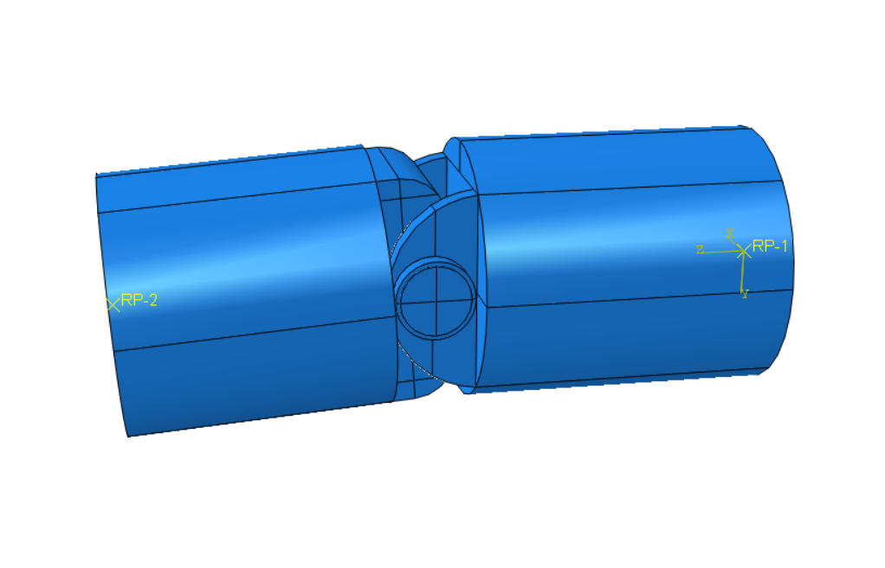
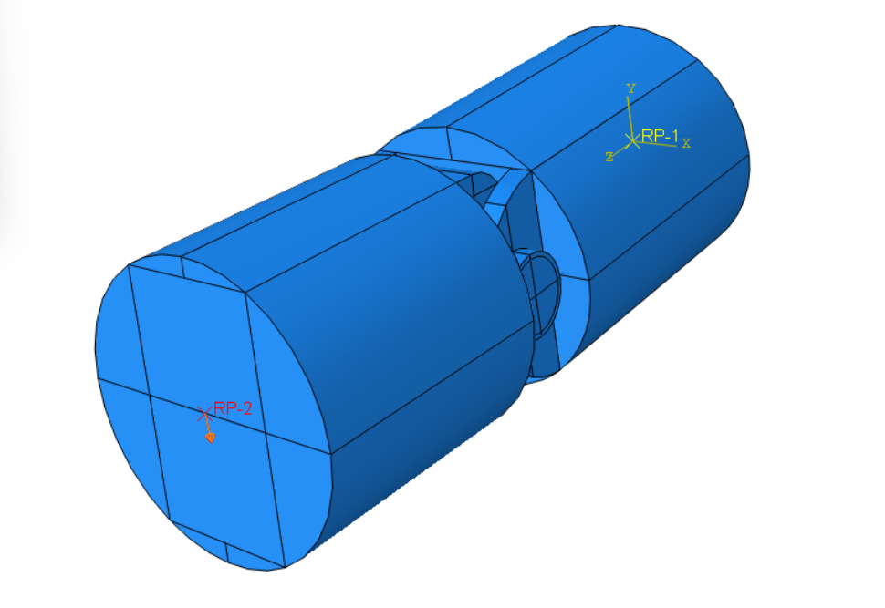
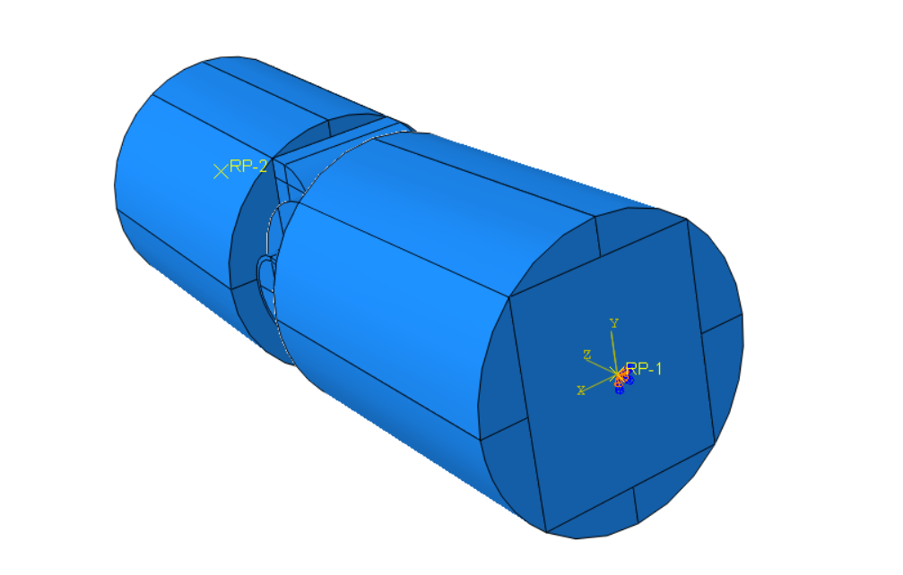
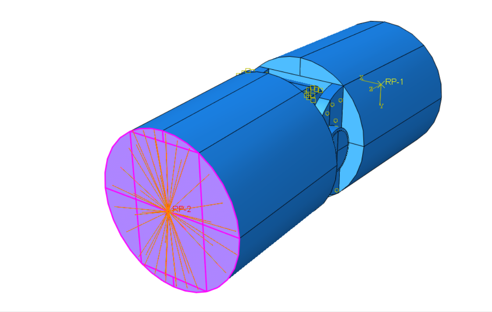
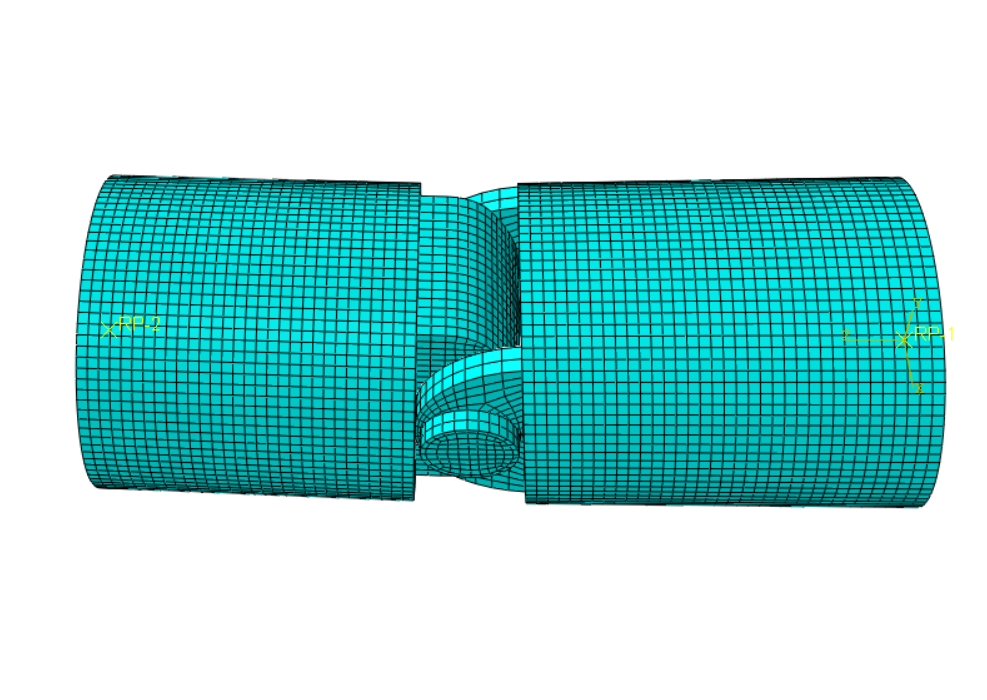
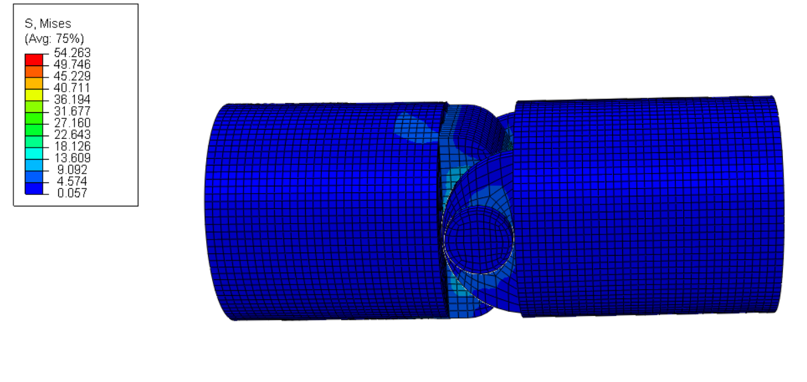
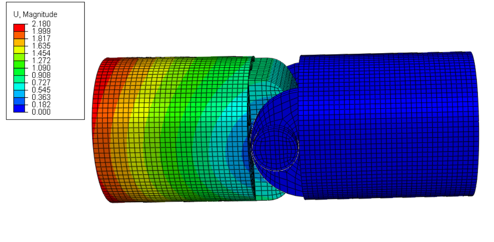

# abaqus-finger-joint-prosthesis
Finite element analysis of a simplified PIP finger joint prosthesis in Abaqus/CAE.
# Finger Joint Prosthesis (PIP) — FEA Study

## Overview
This project presents a finite element analysis (FEA) of a simplified proximal interphalangeal (PIP) finger joint prosthesis evaluated under a functional pinch-loading condition.

The mechanism consists of a four-part assembly where flexion-extension rotation is enabled by a central hinge pin. To evaluate joint stress distribution, contact stability, and required activation force, I developed a non-linear finite element model in **Abaqus/CAE** under a displacement-controlled load of **U2 = -2.0 mm**.

---

## Key Engineering Highlights
* **Non-Linear Kinematics (`Nlgeom: ON`):** Enabled geometric non-linearity to properly capture large rotational kinematics, evolving contact normal vectors, and finite sliding along the hinge interface.
* **Manual Hex Partitioning:** Applied extensive geometric partitioning to create a structured 8-node hexahedral mesh (Hex, Structured/Sweep) across all four components, drastically reducing mesh quality warnings (down to <0.5% localized warnings).
* **Titanium Margin & FOS:** Modeled in Ti-6Al-4V alloy (E = 110,000 MPa, yield limit ~830 MPa). Peak von Mises stress reached **54.26 MPa**, providing a high Factor of Safety of **~15.3**.
* **Functional Kinematics:** A 2.0 mm vertical stroke yielded a reaction force of **53.1 N** (within natural pinch-force limits), with high rotational freedom and near-zero lateral play (U1 ≈ 0.001 mm).

---

## Objective
The primary goals of this finite element analysis were:
* Evaluate maximum von Mises stress levels across all four prosthetic components.
* Verify contact stress distributions and stability along the hinge interface.
* Calculate the total reaction force generated under prescribed displacement.
* Assess rotational kinematics and check for potential lateral instability.
* Ensure structural reliability under simulated physiological loading.

---

## My Contribution
Starting from the base CAD geometry provided by a colleague, I developed the complete FEA setup in Abaqus/CAE, including:
* **Geometry Partitioning:** Executed manual part-level partitioning to enable structured hex meshing on complex curved surfaces.
* **Non-Linear Step & Solvers:** Configured a non-linear static step with adaptive contact stabilization to assist convergence during initial contact engagement.
* **Contact & Interface Setup:** Defined Surface-to-Surface pairs with penalty friction (μ = 0.15) and finite sliding formulations.
* **Kinematic Idealization:** Created Reference Points and structural distributing couplings to transfer loads and boundary conditions without artificial stress concentrations.
* **Post-Processing & Validation:** Extracted reaction force curves, joint displacement envelopes, and stress distributions.

---

## Software and Tools
* **Abaqus/CAE** (FEA modeling, solver & post-processing)

---

## Model Setup & Assembly
The simplified prosthetic assembly consists of four key components:
1. **Proximal Articular Implant:** The fixed component anchored to the bone.
2. **Distal Component:** The rotating lever arm that replicates finger flexion.
3. **Hinge Pin:** The central shaft defining the rotational axis.
4. **Locking Ring Nut:** Secures the hinge pin against axial movement.

---

## Material Properties
All components were assigned an isotropic linear elastic material model representing medical-grade **Ti-6Al-4V titanium alloy**.

| Property | Value |
| :--- | ---: |
| Material | Ti-6Al-4V Alloy |
| Young's modulus (E) | 110,000 MPa |
| Poisson's ratio | 0.33 |
| Yield strength | ~830–900 MPa |

A homogeneous solid section was assigned to all four parts.

---

## FEA Setup & Boundary Conditions

### Step & Loading Controls
* **Analysis Type:** Static, General (`Nlgeom: ON`)
* **Displacement Load:** A prescribed vertical displacement of **U2 = -2.0 mm** was applied at Reference Point 2 (RP-2), coupled to the front face of the distal component. Rotational degrees of freedom were left unconstrained to allow natural joint articulation.

### Boundary Conditions & Interactions
* **Fixed Support:** An **ENCASTRE** condition was applied via RP-1 to the circular rear face of the proximal implant.
* **Tie Constraints:** Applied between the hinge pin and proximal implant lugs, and between the locking ring nut and pin end.
* **Contact Pair:** Surface-to-Surface contact between the outer surface of the hinge pin and the internal bore of the distal component, using Hard normal behavior, Penalty friction (μ = 0.15), and Finite Sliding.
* **Structural distributing couplings:** Applied in order to distribute the boundary condition and prescribed displacement over the corresponding circular faces.

---

## Mesh
All four components were manually partitioned at the part level to achieve a structured hexahedral mesh.

| Mesh Parameter | Value |
| :--- | ---: |
| Element Type | Hexahedral (Hex) |
| Meshing Technique | Structured |
| Global Element Size | 1.0 mm |
| Curvature Control | 0.05 |

---

## Results & Discussion

### Reaction Force & Resistance
Under the prescribed **U2 = -2.0 mm** flexion stroke, the model generated the following reaction forces at the fixed base:

| Component / Direction | Reaction Force | Interpretation |
| :--- | ---: | :--- |
| **RF2 (Vertical)** | **53.10 N** | Primary therapeutic pinch force |
| RF3 (Longitudinal) | 0.10 N | Minimal axial shear force |
| RF1 (Transverse) | 0.00 N | Zero lateral reaction force |
| **RF Total** | **53.11 N** | **Total reaction magnitude** |

The 53.1 N reaction force matches typical physiological pinch forces required during light functional grasping tasks.

---

### Von Mises Stress Analysis
The maximum von Mises stress reached **54.26 MPa**, located on the internal bearing surface of the distal component near the contact line with the hinge pin.

| Component | Max von Mises Stress | Material Yield Strength | Factor of Safety (FOS) |
| :--- | ---: | ---: | ---: |
| **Distal Component** | **54.26 MPa** | **~830 MPa** | **15.3** |
| Hinge Pin | 41.54 MPa | ~830 MPa | 20.0 |
| Proximal Implant | 12.33 MPa | ~830 MPa | 67.3 |
| Locking Ring Nut | 3.34 MPa | ~830 MPa | 248.5 |

---

### Joint Displacement & Kinematics
Displacement contours confirm smooth joint rotation without binding or lateral misalignment.

| Parameter | Value | Kinematic Significance |
| :--- | ---: | :--- |
| U1 (Lateral) | ~0.001 mm | High joint stability against dislocation |
| U2 (Vertical) | -2.035 mm | Prescribed joint flexion stroke |
| U3 (Longitudinal Range) | +0.931 to -0.852 mm | Rotational sweeping motion |
| **U Magnitude (Total)** | **2.180 mm** | **Peak total displacement** |

---

## Conclusions
1. **High Safety Factor:** With a peak von Mises stress of 54.26 MPa relative to an 830 MPa yield limit, the prosthesis achieves a Factor of Safety of ~15.3 under functional pinch loading.
2. **Stable Contact Kinematics:** Non-linear contact modeling verified smooth rotation of the distal component around the hinge pin with negligible lateral instability (U1 ≈ 0.001 mm).
3. **Biomechanical Feasibility:** The required 53.1 N reaction force confirms that the prosthesis operates within realistic anatomical pinch load ranges.
